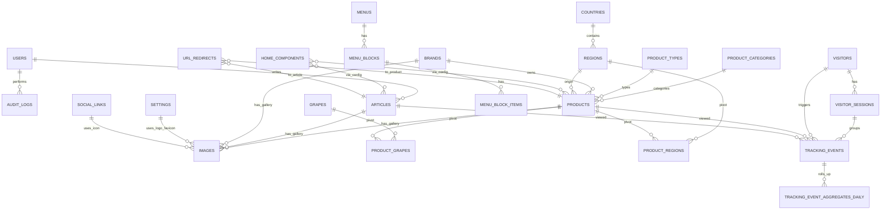

# Tài liệu chốt v1.2 – Web rượu/bia/thịt nguội/bánh (27/10/2025)

**Phiên bản:** 1.2

**Ngày chốt:** 27/10/2025

**Mục tiêu:** Tài liệu kỹ thuật–QA chốt cuối, đủ để Dev/QA/PM triển khai–nghiệm thu không mơ hồ. Bao quát: mục tiêu & chức năng, schema & ERD, luật vận hành/ngoại lệ, API, hiệu năng, bảo mật, checklist.

---

## I) Mục tiêu & Chức năng

### 1. Mục tiêu

* Website giới thiệu & tra cứu sản phẩm (rượu/bia/thịt nguội/bánh)  **không bán trực tiếp** ; CTA chính:  **“Liên hệ”** .
* Tối ưu SEO, tốc độ, và báo cáo hành vi (view, CTA).
* Admin (Filament 4.x) quản trị nội dung, hình ảnh (polymorphic), menu, trang chủ, analytics, audit.

### 2. Phạm vi chức năng chính (FE)

* Trang chủ (build từ `home_components`, bỏ qua item inactive).
* Trang lọc sản phẩm (multi-filter: loại, thương hiệu, quốc gia, vùng, giống nho, tầm giá, dung tích, nồng độ).
* Trang chi tiết sản phẩm (gallery, badge, discount, breadcrumbs).
* Trang bài viết (list/chi tiết, thumbnail từ `images`).
* Trang liên hệ (CTA click tracking).
* Header: menu thuong + **mega menu** linh hoat (block tu dong lay tu taxonomy + item thu cong).
* Footer: settings + social links.

### 3. Phạm vi chức năng (BE/API/Admin)

* API sản phẩm/bài viết/home, filter & sort mặc định.
* Slug thay đổi trả 404 nếu không cập nhật liên kết; dự án không triển khai redirect tự động.
* Ảnh dùng  **bảng polymorphic `images`** ; một số bảng (settings, social_links, catalog_terms icon (term dùng icon type image)) dùng  **FK trực tiếp** .
* Tính **`discount_percent`** ở BE (làm tròn  **0 chữ số** ).
* **Analytics** theo khoảng 7/30/90/all-time;  **event CTA “Liên hệ”** ; dọn raw >90 ngày;  **bảng aggregate daily** .
* Phân quyền: `admin`, `staff` (staff không chỉnh settings/user/redirects/roles).
* SEO: tự sinh meta/OG khi trống; canonical theo slug hiện tại.
* Tracking: visitor/session/event (view, cta_contact).
* Audit log read-only: tra cứu theo user/action/time, export CSV.

---

## II) Bảng – Trường – Quan hệ – ERD

> Ghi chú chung: DB quan hệ (MySQL 8+/PostgreSQL 13+). Kiểu dữ liệu dưới đây ở dạng tổng quát; khi triển khai, map sang RDBMS cụ thể. Tất cả `*_id` là BIGINT UNSIGNED (hoặc UUID nếu chọn), `created_at/updated_at` là timestamp với timezone.

### 1) Danh mục & sản phẩm

* **products**
  * `id`, `name`, `slug` (unique), `product_category_id FK`, `type_id FK`,
  * Thuộc tính: `price` (>=0), `original_price` (>=0), `alcohol_percent` (0..100), `volume_ml` (int >=0), `badges` (SET/JSON: `SALE|HOT|NEW|LIMITED` + custom), `active` (bool),
  * SEO: `meta_title NULL`, `meta_description NULL`,
  * Chỉ số: `INDEX (type_id, product_category_id)`, `INDEX (price)`, `INDEX (alcohol_percent)`, `INDEX (volume_ml)`, `UNIQUE (slug)`.
* **product_categories** : `id`, `name`, `slug unique`, `order`, `active`.
* **product_types** : `id`, `name`, `slug unique`, `order`, `active`.
* **catalog_attribute_groups** : `id`, `code UNIQUE`, `name`, `filter_type` (`single|multi|hierarchy|range|tag`), `is_filterable BOOL`, `is_primary BOOL`, `position INT`, `display_config JSON`.
* **catalog_terms** : `id`, `group_id FK`, `parent_id FK NULLABLE`, `name`, `slug unique per group`, `description TEXT NULL`, `icon_type`, `icon_value`, `metadata JSON NULL`, `is_active BOOL`, `position INT`.
* **product_term_assignments** (pivot taxonomy): `id`, `product_id FK`, `term_id FK`, `is_primary BOOL`, `position INT`, `extra JSON NULL`, `created_at`, `updated_at`,
  * `UNIQUE (product_id, term_id)`;
  * `INDEX (term_id, product_id)`;
  * **Quy u?c "ch�nh"** : d�nh `is_primary=true` cho term ch�nh (brand, country, region...) d? hi?n breadcrumb/spec.
### 2) Nội dung & cấu hình

* **articles** : `id`, `title`, `slug unique`, `excerpt`, `content`, `author_id FK users.id`, `active`, SEO fields.
* **images** (polymorphic gallery): `id`, `file_path`, `alt`, `width`, `height`, `mime`, `model_type VARCHAR`, `model_id BIGINT`, `order INT DEFAULT 1`, `active BOOL DEFAULT TRUE`,
  * **Index** : `INDEX (model_type, model_id)`,  **unique cover** : `UNIQUE (model_type, model_id, order)` với ràng buộc `order=0` chỉ duy nhất  **1 ảnh cover** /model, enforced bằng **partial index** (Postgres) hoặc trigger (MySQL).
* **settings** (singleton): cặp key→value hoặc cột tường minh; `logo_image_id FK images.id NULL`, `favicon_image_id FK images.id NULL`.
* **social_links** : `id`, `platform`, `url`, `icon_image_id FK images.id NULL`, `active`.
* **menus** : `id`, `title NULL`, `term_id FK catalog_terms NULL`, `type ENUM('standard','mega')`, `href NULL`, `config JSON`, `order`, `active`.
* **menu_blocks** : `id`, `menu_id FK`, `title`, `attribute_group_id FK catalog_attribute_groups NULL`, `max_terms NULL`, `config JSON`, `order`, `active`.
* **menu_block_items** : `id`, `menu_block_id FK`, `term_id FK catalog_terms NULL`, `label NULL`, `href NULL`, `badge NULL`, `meta JSON`, `order`, `active`.
* **home_components** : `id`, `type ENUM`, `config JSON`, `order`, `active`.

### 3) Tracking & analytics

* **visitors** : `id`, `anon_id` (cookie), `first_seen_at`, `last_seen_at`, `user_agent`, `ip_hash`.
* **visitor_sessions** : `id`, `visitor_id FK`, `started_at`, `ended_at NULL`.
* **tracking_events** : `id`, `visitor_id FK`, `session_id FK`, `event_type ENUM('product_view','article_view','cta_contact')`,

  `product_id NULL FK`, `article_id NULL FK`, `metadata JSON`, `created_at`.

* **tracking_event_aggregates_daily** : `id`, `date`, `event_type`, `product_id NULL`, `article_id NULL`, `views INT`, `clicks INT`,
* **Unique key** : `(date, event_type, product_id, article_id)`;
* **Ghi chú** : `views` và `clicks` dùng theo ngữ cảnh (vd: `product_view` -> `views`; `cta_contact` -> `clicks`).

### 4) Redirect & audit

* **url_redirects** *(tùy chọn, nhập tay khi cần)* :

  `id`, `from_slug VARCHAR UNIQUE`, `to_slug VARCHAR`, `target_type ENUM('Product','Article')`, `target_id BIGINT`, `created_at`,

  * **Ràng buộc** : `from_slug != to_slug`; **không** cho phép trùng với slug hiện hữu của resource.
  * **Ghi chú** : không có cơ chế tự sinh; Admin chỉ tạo/thay đổi khi thật sự cần chuyển hướng.
* **users** : `id`, `name`, `email unique`, `role ENUM('admin','staff')`, `password_hash`, `active`.
* **audit_logs** : `id`, `user_id FK`, `action`, `model_type`, `model_id`, `before JSON NULL`, `after JSON NULL`, `ip_hash`, `created_at`.
* **Read-only** trong Admin.

### 5) ERD (Mermaid)



---

## III) Luật chi tiết & Xử lý ngoại lệ

### A. Slug & 404

1. **Chuẩn slug**: khuyến nghị normalize (lowercase, thay khoảng trắng bằng ``-``, bỏ ký tự không an toàn) khi seed hoặc nhập tay để nhất quán SEO.
2. **Unique**: dựa trên ràng buộc DB; nếu trùng trả về 422 để người nhập điều chỉnh (không tự gắn hậu tố).
3. **Đổi slug**: đường dẫn cũ sẽ trả 404 nếu không cập nhật liên kết; chỉ tạo ``url_redirects`` thủ công khi business thật sự cần giữ đường dẫn cũ.
4. **Canonical**: luôn dùng slug hiện tại.
### B. Ảnh (polymorphic) & FK trực tiếp (logo/icon)

1. **Gallery** : dùng `images(model_type, model_id, order)`; `order=0` là **cover** (duy nhất).

* **Enforce** : unique partial `order=0`/model; nếu 2 request đồng thời set `order=0`, request đến sau bị 409 (conflict).

1. **Logo/Icon** (FK trực tiếp): `settings.logo_image_id/favicon_image_id`, `social_links.icon_image_id`, `catalog_terms.icon_value (icon_type=image)`.
   * Có thể **không** có dòng `images` tương ứng (không bắt buộc tạo dòng polymorphic).
2. **Xoá ảnh đang được dùng bởi FK** : **`NULLIFY` + cảnh báo** (log + toast Admin).

* Không chặn xoá; sau xoá, UI hiển thị  **placeholder** .

1. **Xoá model cha** (product/article/catalog_term…):
   * Chính sách gallery: **soft-delete ảnh** hoặc **orphan cho phép** → dọn định kỳ bằng job “media garbage collector”.
2. **Placeholder** : nếu không có cover, FE dùng placeholder theo loại (product/article/catalog_term/icon).

### C. Giá & khuyến mãi

1. **Quy tắc hiển thị** :

* `price > 0`: hiển thị giá VND.
* `price = 0`: hiển thị "Liên hệ".
* `original_price > price > 0`: hiển thị giá gạch +  **% giảm** .

1. **`discount_percent` (server-side)** :

* Công thức: `(original_price - price)/original_price*100`.
* **Làm tròn** : **0 chữ số** (round-half-up).
* Trả **`null`** nếu không thoả `original_price > price > 0`.
* Không âm, không chia 0; nếu input sai → 422.

1. **Nguồn sự thật** : chỉ dùng giá trị do BE trả; FE **không** tự tính lại.

### D. Lọc sản phẩm & hiệu năng

1. **Tham s?** : `terms[brand][]`, `terms[origin.country][]`, `terms[origin.region][]`, `terms[grape][]`, `type[]`, `price_min/max`, `alcohol_min/max`, `page`, `per_page`.
2. **Hành vi** :

* Nhiều giá trị ⇒ `WHERE IN`/join pivot; sau join phải **DISTINCT** theo `products.id`.
* Giá trị mảng **không hợp lệ** → **bỏ qua** (vẫn 200).
* `price_min > price_max` hoặc `alcohol_min > alcohol_max` → **400** (validation error).

1. **Sort mặc định** : `created_at DESC`; có thể nhận `sort` hợp lệ (`price`, `-price`, `name`, `-created_at`...).
2. **Hiệu năng** : P95 < 100ms với dữ liệu giả lập ~100k products, ~1M rows pivot; EXPLAIN đính kèm khi nghiệm thu.
3. **Indexing** : giữ index đơn lẻ cho cột lọc + index nghịch ở pivot (`(grape_id, product_id)`, `(region_id, product_id)`).

### E. Trạng thái `active`

* `active=false` ⇒  **ẩn toàn hệ thống** : list, chi tiết, home, search, sitemap, RSS/SEO.
* Truy cập chi tiết của resource inactive ⇒ **404** (không 301).
* Toggle `active` ⇒ **purge cache** liên quan.

### F. Analytics & dọn dữ liệu

1. **Event** :

* `product_view(product_id)`, `article_view(article_id)`, **`cta_contact`** (metadata: vị trí click, kênh).

1. **Khoảng thời gian dashboard** : 7/30/90/all-time; CSV export trùng số liệu hiển thị (sai lệch ≤ 0.5%).
2. **Dọn raw** : xoá `tracking_events` **>90 ngày** (rolling), **sau khi** đã đổ vào `tracking_event_aggregates_daily`.
3. **Aggregates daily** : job hàng ngày (`00:30`): upsert theo `(date, event_type, product_id, article_id)`.
4. **All-time** : tính từ bảng aggregate (SUM theo khoảng) + phần raw <90d nếu cần (đảm bảo không double-count).

### G. SEO

* **Auto meta** khi trống:
  * `meta_title`: cắt ≤ 60 ký tự (không vỡ từ).
  * `meta_description`: cắt ≤ 160 ký tự.
  * `og:image`: ưu tiên product cover → term icon (n?u icon_type=image) → site default (tỷ lệ ~1.91:1; khuyến nghị 1200×630).
* **Sitemap** : không liệt kê resource inactive.
* **Canonical** : luôn là slug hiện tại.

### H. Quyền hạn & Audit

* Role `staff`: **không** sửa `settings`, `users`, `url_redirects`, `roles/permissions`.
* Mọi truy cập trái phép: HTTP 403 + ghi `audit_logs` action `denied` (model/route, ip_hash).
* `audit_logs` **read-only** trên Admin; filter theo user/action/time; CSV export.

### I. Caching / CDN / Concurrency

* Cache trang & API GET (60s–300s), purge khi: đổi slug, đổi `active`, đổi gallery cover, đổi SEO fields.
* Concurrency: dùng **optimistic lock** hoặc unique constraint + retry cho `order=0` cover.
* Redirect middleware cacheable: `Cache-Control: public, max-age=3600`.

### J. Lỗi & Mã trả về

* 200: thành công.
* 400: tham số phạm vi sai (`price_min > price_max`, `alcohol_min > alcohol_max`).
* 401/403: chưa đăng nhập/không đủ quyền Admin.
* 404: slug không tồn tại hoặc resource inactive.
* 409: xung đột cover `order=0`.
* 422: dữ liệu không hợp lệ (giá âm/NaN).
* 500: lỗi không xác định (ghi log + correlation id).

---

## IV) API Contract (rút gọn nhưng đủ test)

### 1) `GET /san-pham`

 **Query** : `terms[brand][]`, `terms[origin.country][]`, `terms[origin.region][]`, `terms[grape][]`, `type[]`, `price_min`, `price_max`, `alcohol_min`, `alcohol_max`, `page`, `per_page`, `sort`

**200**

```json
{
  "data": [
    {
      "id": 123,
      "name": "Rượu A",
      "slug": "ruou-a",
      "price": 1000000,
      "original_price": 1500000,
      "discount_percent": 33,
      "main_image_url": "https://.../img1.jpg",
      "gallery": [{"url": "https://.../img1.jpg", "order": 0}, {"url": "https://.../img2.jpg", "order": 1}],
      "brand_term": {"id": 1, "name": "Brand X"},
      "country": {"id": 2, "name": "Pháp"},
      "alcohol_percent": 13.5,
      "volume_ml": 750,
      "badges": ["SALE", "HOT"]
    }
  ],
  "meta": {"page": 1, "per_page": 24, "total": 1234, "sort": "created_at:desc"}
}
```

 **400** : phạm vi sai.

 **422** : dữ liệu không hợp lệ.

### 2) `GET /san-pham/{slug}`

```json
{
  "id": 123,
  "name": "Rượu A",
  "breadcrumbs": [{"label": "Rượu vang", "href": "/ruou-vang"}],
  "gallery": [...],
  "discount_percent": 33,
  "active": true
}
```

 **404** : không tồn tại/ inactive.

### 3) `GET /bai-viet` & `GET /bai-viet/{slug}`

* List có thumbnail từ `images(model_type='Article')` hoặc cover `order=0`.

### 4) `GET /home`

* Build từ `home_components` (`active=true`, `order ASC`). Bỏ qua tham chiếu đến sản phẩm/bài viết/ảnh  **đã inactive hoặc bị xoá** ; ghi log cảnh báo.

## V) Hiệu năng & Chỉ số

* **Mục tiêu** : P95 `GET /san-pham` < 100ms với dữ liệu lớn; P99 < 200ms.
* **Index** : theo mục II; pivot có index nghịch; cân nhắc covering index cho đường hot-path.
* **EXPLAIN** : mọi query filter/chi tiết đính kèm report nghiệm thu.
* **SLO** : uptime 99.9%, lỗi 5xx < 0.1% request/tháng.

---

## VI) Bảo mật & Tuân thủ

* **Role-based access** : `admin`/`staff`; chặn mọi chỉnh sửa nhạy cảm với `staff`.
* **XSS** : sanitize nội dung nhập tay (menu link label, block config).
* **CORS** : whitelist domain FE.
* **Rate-limit** : API public 60 req/min/IP.
* **PII** : chỉ lưu `ip_hash`, không lưu IP thô; tuân thủ dọn dữ liệu.
* **Audit** : ghi đầy đủ before/after đối tượng quan trọng; immutable (không edit/delete qua Admin).

---

## VII) Migrations & Jobs đề nghị

* **DB constraints** :
* `products.slug` unique; chuẩn hoá slug ở layer nhập liệu/seed.
* `price >= 0`, `original_price >= 0`, `0 <= alcohol_percent <= 100`.
* Unique partial cover `(model_type, model_id, order=0)`.
* **Jobs** :
* Nightly: build `tracking_event_aggregates_daily`, purge raw >90d.
* Weekly: media GC dọn ảnh orphan.

---

## VIII) Checklist nghiệm thu (QA)

* [ ] Canonical/OG đúng sau đổi slug (không trỏ về `from_slug`).
* [ ] DISTINCT sản phẩm khi filter nhiều pivot; không trùng.
* [ ] Cover `order=0` duy nhất cho mỗi model; conflict trả 409.
* [ ] `discount_percent` trả **null** khi không giảm; nếu có, làm tròn  **0 chữ số** .
* [ ] Staff truy cập Settings/Users/Redirects → 403 + `audit_logs` action `denied`.
* [ ] CSV analytics khớp dashboard ±0.5%.
* [ ] Sitemap không chứa resource inactive.
* [ ] Home bỏ qua tham chiếu tới resource inactive/đã xoá + log cảnh báo.
* [ ] `GET /san-pham` P95 < 100ms (dataset seed lớn), EXPLAIN OK.

---

## IX) Phụ lục

### A. Cấu hình `home_components` (tham khảo)

* **HeroCarousel** : `{ "slides": [{"image_id":1,"alt":"..."}] }`
* **DualBanner** : `{ "banners": [{"image_id":1,"alt":"...","href":"/abc"}] }`
* **CategoryGrid** : `{ "categories": [{"name":"Vang đỏ","image_id":1,"href":"/..."}] }`
* **FavouriteProducts** : `{ "products": [{"product_id":1,"badge":"SALE"}] }`
* **BrandShowcase** : `{ "brands": [{"term_id":1,"href":"/..."}] }`
* **CollectionShowcase** : `{ "title":"Rượu Vang","subtitle":"...","description":"...","ctaLabel":"Xem thêm","ctaHref":"/ruou-vang","tone":"wine|spirit","products":[{"product_id":1,"badge":"HOT"}] }`
* **EditorialSpotlight** : `{ "title":"Cẩm nang rượu","articles":[{"article_id":1}] }`

### B. Event taxonomy (mẫu metadata)

* `product_view`: `{ "placement": "grid|detail|home", "component": "FavouriteProducts|..." }`
* `article_view`: `{ "placement": "list|detail" }`
* `cta_contact`: `{ "placement": "header|footer|product_detail|contact_page", "method": "tel|mailto|form|zalo" }`

### C. Quy ước đặt tên & định dạng

* Slug: lowercase, `-` nối, không dấu/space, ASCII-safe; hậu tố `-1`, `-2`… nếu trùng.
* Ảnh cover: `order=0`; còn lại `order>=1`.
* Badge enum chuẩn: `SALE|HOT|NEW|LIMITED`; custom lưu ở JSON kèm style FE.

### D. Lưu ý triển khai FE

* `price=0` hiển thị “Liên hệ”.
* Fallback ảnh: placeholder theo loại.
* Khi nhận `discount_percent=null` → ẩn nhãn giảm giá.

### E. Test data seed gợi ý

* 100k products; mỗi product 3–5 grapes (pivot ~350k), 1–2 regions (pivot ~150k).
* Term dataset: ~40 brand terms, ~40 origin countries + 80 sub-regions, ~40 grape terms.
* 30% sản phẩm có `original_price > price`.
* 10% inactive.
* Sự kiện: 30 ngày gần nhất ~ 3M `product_view`, 200k `cta_contact`.

---

**Kết luận** : Tài liệu này phản ánh các quyết định **đã chốt** (v1.2), bao gồm cập nhật quan trọng: slug đổi trả 404 (không redirect auto),  **`discount_percent=null` & làm tròn 0** ,  **polymorphic images + FK nullify** ,  **thêm event CTA & aggregates daily** , cùng toàn bộ luật/ngoại lệ để QA nghiệm thu khắt khe vẫn rõ ràng và đo được.


