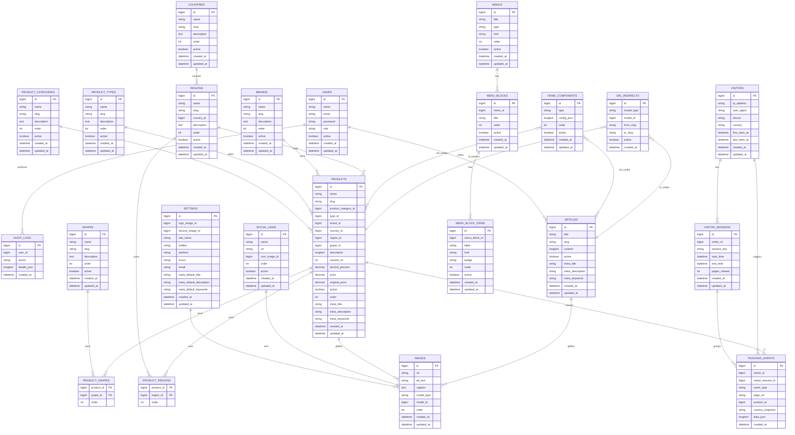

# Dự án web rượu/bia/thịt nguội/bánh – **Bản chốt theo phản hồi khách**

> Phiên bản: **1.1** (27/10/2025)
>
> Thay đổi chính: cập nhật các **quyết định đã chốt** theo phản hồi 1→10; điều chỉnh API và ERD tương ứng.

---

## A) Quyết định đã chốt (1 → 10)

1. **Giống nho / Vùng sản xuất – CHỐT**

   • Hỗ trợ **nhiều giống nho** và **nhiều vùng** qua pivot `product_grapes`, `product_regions`.

   • Có thể đánh dấu **“chính”** bằng `order=0` trên pivot để hiển thị marketing.
2. **Filter sản phẩm nhiều giá trị – CHỐT**

   • UI  **multi-select** ; backend `WHERE IN`/join pivot.

   • Hỗ trợ lọc: loại, thương hiệu, quốc gia, vùng, giống nho, tầm giá, dung tích, nồng độ.
3. **Đổi slug & Redirect – CHỐT**

   • Tự động tạo redirect 301 khi slug đổi.

   • Bảng `url_redirects(from_slug → to_slug)`; không giới hạn TTL.
4. **Hình ảnh – OKE**

   • Không bắt buộc có ảnh cover khi publish; nếu thiếu, FE dùng **placeholder** theo loại.

   • Admin được cảnh báo khi lưu/publish không có ảnh.
5. **Badge hiển thị – OKE**

   • Dùng **enum** chuẩn: `SALE`, `HOT`, `NEW`, `LIMITED`.

   • Cho phép **label tùy chỉnh** (text ngắn) nếu cần; enum vẫn ưu tiên để thống nhất style.
6. **Giá khuyến mãi & % giảm – "để sẵn trong API"**

   • Backend **tính sẵn** `discount_percent` (round 0–1 chữ số thập phân).

   • FE **tùy** sử dụng: hiển thị `%` hoặc chỉ giá gạch.

   • Logic: nếu `price>0` & `original_price>price` ⇒ `discount_percent = (original_price-price)/original_price*100`.
7. **Analytics theo thời gian – CHỐT**

   • Dashboard chọn  **7/30/90 ngày & all-time** ; export CSV.

   • Có thể dọn `tracking_events` >90 ngày, vẫn giữ tổng quan.
8. **Ẩn sản phẩm/bài viết – CHỐT**

   • Khi `active='false'`, mọi block/homepage bỏ qua item đó, không báo lỗi.
9. **Mega menu linh hoạt – OKE**

   • Cho phép block tùy biến (ví dụ “Ưu đãi Tết”), tiêu đề + danh sách link custom, không giới hạn vào quốc gia/giống nho.
10. **Audit log trong Admin – OKE**

    • Có trang **read-only** để tra cứu theo thời gian/action/user,  **export CSV** .

---

## B) Tóm tắt hệ thống (không đổi trọng yếu)

* **Không bán trực tiếp** ; CTA  **Liên hệ** .
* **Trang** : Trang chủ (qua `home_components`), Trang lọc, Trang chi tiết, Editorial, Liên hệ.
* **Header** : menu thường + mega menu;  **Footer** : settings + social links.
* **Admin (Filament 4.x)** : quản lý sản phẩm/thuộc tính/danh mục, images, homepage blocks, menu, bài viết, settings, analytics, audit log.
* **Phân quyền** : `admin`, `staff` (staff không chỉnh settings và không chỉnh/xóa user khác).
* **SEO** : meta auto khi để trống.
* **Tracking** : visitor, session, event.

---

## C) ERD (Mermaid) – cập nhật theo bản chốt

---

## D) API/Controller – điều chỉnh theo bản chốt

* **Danh sách sản phẩm** `GET /san-pham`
  * Query: `brand[]`, `country[]`, `region[]`, `grape[]`, `type[]`, `price_min`, `price_max`, `alcohol_min`, `alcohol_max`…
  * Mặc định sort `created_at DESC`; phân trang.
  * Join pivot khi có `region[]`/`grape[]` nhiều giá trị.
* **Chi tiết sản phẩm** `GET /san-pham/{slug}`
  * Trả: product + gallery + breadcrumbs + **`discount_percent`** (tính sẵn).
  * FE **có thể** dùng `%` hoặc bỏ qua, tùy UI.
* **Bài viết** `GET /bai-viet`, `GET /bai-viet/{slug}`.
* **Trang chủ** `GET /home`
  * Build từ `home_components`; tự bỏ qua item inactive/404.
* **Redirect**
  * Middleware check `url_redirects.from_slug` → 301 đến `to_slug`.

---

## E) Index/Performance

* **Sản phẩm** : `INDEX (brand_id, country_id, region_id, type_id, product_category_id)`, `INDEX (alcohol_percent)`, `INDEX (volume_ml)`, `INDEX (price)`.
* **Pivot** : PK composite + index nghịch `grape_id`, `region_id`.
* **Tracking** : `tracking_events(product_id, created_at)`, `tracking_events(visitor_id, visitor_session_id)`.
* **Slug/Redirect** : `UNIQUE(slug)`; `url_redirects.from_slug UNIQUE`.

---

## F) Quy ước FE (không đổi)

* **Giá** : `price>0` → hiển thị VND; nếu `original_price>price` → giá gạch + **% giảm** (nếu FE dùng). `price=0` → "Liên hệ".
* **Sort list** : `created_at DESC` (trừ nơi dùng `order`).
* **Slug** : tự sinh; cập nhật theo tên;  **có redirect** .
* **Ảnh** : cover = `order=0`; vắng cover dùng placeholder.
* **Homepage** : render `active='true'` theo `order ASC, created_at DESC`.

---

## G) Filament Resources

* Product, Category, Type, Brand, Country, Region, Grape,  **Product↔Grape (pivot)** ,  **Product↔Region (pivot)** .
* Article, Image (Media), Menu, MenuBlock, MenuBlockItem.
* HomeComponent (form JSON theo type).
* Settings (singleton), SocialLink.
* Tracking (read-only),  **AuditLog (read-only)** .

---

## H) Checklist gửi khách nghiệm thu

* [ ] Filter multi-select chạy nhanh (EXPLAIN OK).
* [ ] Redirect slug cũ hoạt động 301.
* [ ] Placeholder ảnh nhất quán.
* [ ] `discount_percent` có trong API; FE hiển thị tùy chọn.
* [ ] Analytics 7/30/90/all + export.
* [ ] Staff bị khóa Settings & User management.
* [ ] SEO auto meta + OG từ ảnh cover.

---

### Phụ lục – Cấu hình `home_components` (tham khảo)

* **HeroCarousel** : `{ "slides": [{"image_id":1,"alt":"..."}] }`
* **DualBanner** : `{ "banners": [{"image_id":1,"alt":"...","href":"/abc"}] }`
* **CategoryGrid** : `{ "categories": [{"name":"Vang đỏ","image_id":1,"href":"/..."}] }`
* **FavouriteProducts** : `{ "products": [{"product_id":1,"badge":"SALE"}] }`
* **BrandShowcase** : `{ "brands": [{"brand_id":1,"href":"/..."}] }`
* **CollectionShowcase** : `{ "title":"Rượu Vang","subtitle":"...","description":"...","ctaLabel":"Xem thêm","ctaHref":"/ruou-vang","tone":"wine|spirit","products":[{"product_id":1,"badge":"HOT"}] }`
* **EditorialSpotlight** : `{ "title":"Cẩm nang rượu","articles":[{"article_id":1}] }`
